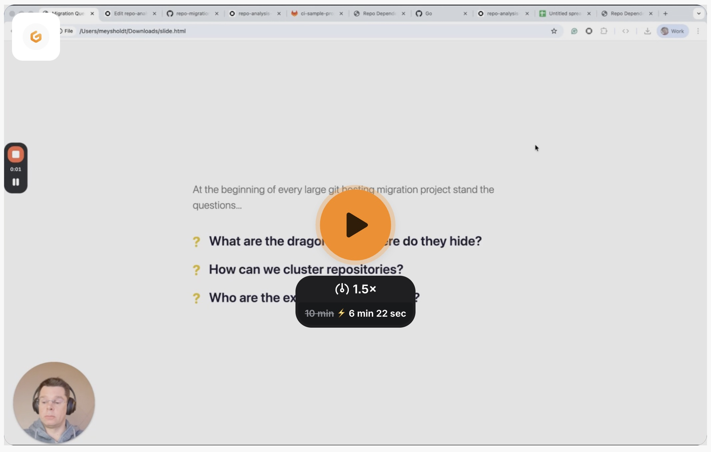

# Repo Migration Analysis

## The Problem

At the beginning of every large git hosting migration (e.g. GitLab → GitHub, Bitbucket → GitLab, etc.) the same questions come up:

- **What are the dragons and where do they hide?** — Which repos have unusual CI setups, deep submodule trees, or hidden cross-repo wiring that will break during migration?
- **How can we cluster repositories?** — Which repos belong together and should be migrated as a group?
- **Who are the experts per repository?** — Who should be involved in planning and validating each migration batch?

Answering these questions manually across hundreds or thousands of repos is slow and error-prone. This demo shows how an Ona automation can analyze every repository in an organization and produce a structured inventory — including descriptions, tech stacks, build tooling, toolsmiths (key contributors to CI/build infrastructure), and cross-repo dependencies — then visualize the dependency graph.

[](https://www.loom.com/share/0553443eea074eab9b882151ed2ed8b8)

## What's in This Repo

| File | Purpose |
|---|---|
| `repo-analysis-demo.yaml` | Ona automation that clones each repo and extracts five fields: description, stack, tools, toolsmiths, and cross-repo dependencies. |
| `dependencies.html` | Browser-based viewer: drag & drop the CSV report to render an interactive Mermaid dependency graph. |
| `slide.html` | Presentation slide summarizing the migration questions this demo addresses. |

## How to Reproduce

### Prerequisites

- An [Ona](https://ona.com) account with a runner connected to your SCM (GitHub, GitLab, etc.)
- A project (or set of projects) pointing at the repositories you want to analyze
- The [Ona CLI](https://ona.com/docs/cli) installed and authenticated:

```
ona login
```

### Step 1 — Install the automation

Register the automation with Ona:

```
ona ai automation create repo-analysis-demo.yaml
```

The automation is configured with a manual trigger. It will run against every project in the scope you assign.

### Step 2 — Configure the target projects

In the Ona dashboard, edit the automation's trigger to target the projects (repositories) you want to analyze. You can scope it to a single project for a quick test or an entire organization for a full migration inventory.

### Step 3 — Run the automation

Trigger the automation manually from the Ona dashboard or via the CLI. Each run spawns one agent per repository (up to 10 in parallel, 100 total). Each agent inspects the checked-out repo and produces:

- **description** — one-sentence summary of what the repo does
- **stack** — languages, frameworks, databases, runtimes
- **tools** — build/deploy tools and CI/CD platform
- **toolsmiths** — top 3 contributors to CI/build files (by commit count)
- **dependencies** — other git repos this repo references (submodules, CI includes, Terraform modules, etc.)

### Step 4 — Download the report

Once all runs complete, download the results as a CSV from the Ona dashboard.

### Step 5 — Visualize dependencies

Open `dependencies.html` in a browser (just double-click the file or serve it locally). Drag and drop the downloaded CSV onto the page. The viewer parses the `dependencies` column, builds a Mermaid graph, and renders an interactive diagram where:

- Each node is a repository (click to open its URL)
- Each edge shows a dependency, labeled with the source file where the reference was found
- Repos are displayed as `org/name` for readability

### Updating the automation

After editing `repo-analysis-demo.yaml`, find the automation ID and apply the update:

```
ona ai automation list
ona ai automation update <automation-id> repo-analysis-demo.yaml
```